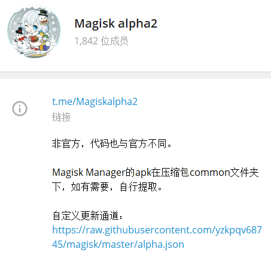
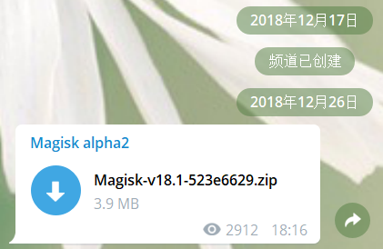
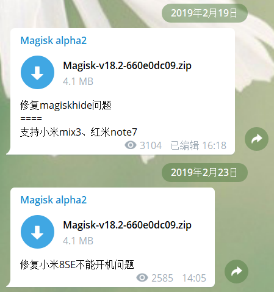

# Say Goodbye To MagiskAlpha2

&emsp;&emsp;MagiskAlpha2 是一个鲜为人知的第三方 Magisk 版本，曾经造福了不少刷机爱好者，我便是其中之一。

    

&emsp;&emsp;2018 年国庆，我入手了 小米8SE 这部手机，当时手机 root 只能使用 Magisk16 版本，刷入新版本的 Magisk 会导致无法开机，在酷安看着各位酷友使用新版 Magisk 很是难受。每次 Magisk 发布新版本或 MIUI 系统更新我都会尝试新版 Magisk，但是一直以失败告终，后来又酷友提出替换文件的解决方法，但是刷入模块存在问题 ...

&emsp;&emsp;三个多月，无论官方 Magisk 更新还是 MIUI 系统更新都没有解决 小米8SE 刷入新版 Magisk 无法开机的问题，在我快心灰意冷的时候，看到了 MagiskAlpha2 修复 小米8SE 不能开机的问题的通知，我第一时间刷入体验，开机，模块完美运行，真香 ...

&emsp;&emsp;之后我一直停留在 MagiskAlpha2 的自定义更新通道，官方应该是 Magisk20 发布后才解决了 小米8SE 的开机问题。

    

&emsp;&emsp;2020 年 2 月 1 日，MagiskAlpha2 作者发出了弃坑通知，是时候后说再见了，感谢在这一年多的时间里为许多机友解决了 Magisk 不兼容的问题。

&emsp;&emsp;轻轻地来，轻轻地去，感谢相伴，有缘再见 ...

* Telegram 电报群 [https://t.me/Magiskalpha2](https://t.me/Magiskalpha2)

* 自定义更新通道 [https://raw.githubusercontent.com/yzkpqv68745/magisk/master/alpha.json](https://raw.githubusercontent.com/yzkpqv68745/magisk/master/alpha.json)