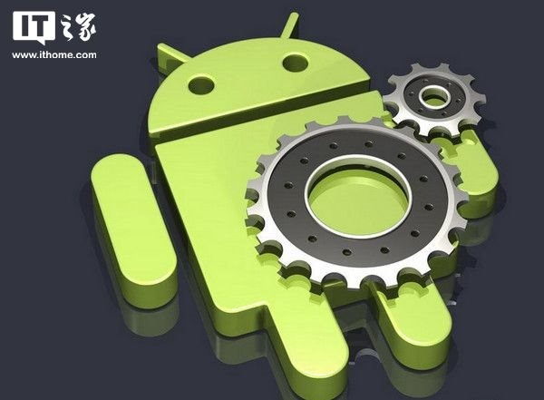
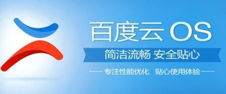
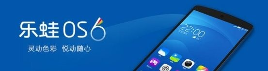
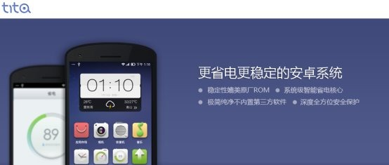
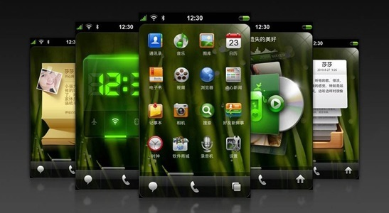
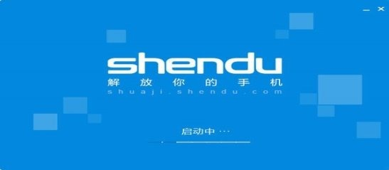
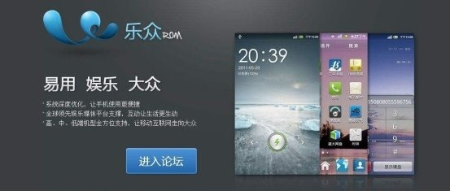

> 本文转自 IT 之家：[刷机时代的情怀：盘点那些逝去的安卓手机ROM](https://www.ithome.com/html/android/307392.htm) 
> 作者：打不死的喂小强，发表于：2017/05/04

安卓系统的火热离不开它高度自由以及可定制，当年由于安卓原生系统的简陋，不少定制的rom层次不穷，它也让安卓用户在不更换手机只刷入新rom的情况下就能带来多彩缤纷的手机体验。

在国内，不少厂商也看到了其中巨大的市场，纷纷推出旗下定制的安卓系统，也就是rom。但是在智能手机市场迎来它的盛世的时候，这些rom则迎来了它的末日黄昏。今天我想盘点一下国内那些逝去的rom，去缅怀当年百花齐放的黄金时期。

一、百度云

百度云rom内置了诸多的百度系应用，例如百度输入法、百度地图、百度云盘等，你只需要在手机上登录自己百度账号，则可以单点登录，在这些应用里无缝切换，很方便。同时结合百度自身强大的搜索引擎，开发了语音搜索、热词锁屏、划词搜索、点滴搜索、和图像搜索等功能。当时的百度云还是很有特点的，对二级菜单的执着，反转的天气动态，这些都是让我喜爱的地方。但是最后由于资金链的断裂，百度云rom也随之离去，停止了更新。

二、乐蛙

乐蛙rom可以说是国内第一个做负一屏的rom，其秉承更美、更轻、更懂你的设计理念，在视觉、易用性、本地化、人性化、安全性方面对原生android进行了大量优化和创新。

乐蛙OS完美地统一了界面的视觉语言，从第一眼印象到每一天的日常使用，都能够感受到它的精致、漂亮；在界面和交互细节上不断打磨；同时改善了重点的用户体验，优化各种的界面细节。可以说当时乐蛙rom相当火爆，在第三方ROM里面已经很出色了，很多手机或者平板厂商都用这个当官方ROM，甚至诺基亚安卓X系列还和乐蛙进行过合作。但是好景不长，由于国内的盈利不足等问题，乐蛙科技最终宣布停止国内rom的适配和更新。

三、iuni

Iunirom是iuni智能手机的操作系统，是一款基于android定制开发的rom，同样也可以用在其他品牌的手机产品中。

Iunirom采用扁平化设计，精简交互理念。同时iunirom不预装第三方应用，将应用选择权交还给用户。我个人非常喜欢iunirom的纯净，但是拿上手纯净和后续需要更多个性化的选择完全是两个概念。就好像很多人喜欢开电脑就打开qq，但是开机启动就是不愿意设置。所以iunirom最大的优点是生来纯净，最大的缺点是到死都纯净。

四、腾讯tita

继百度、阿里、小米等公司相继推出了android定制rom后，国内互联网巨头腾讯也正式插手了的这一行业，推出了自家出品的android第三方rom——tita。

tita来自于音译踢踏，象征着轻快、简洁。tita基于Android4.0内核开发，具备“电量策略管理”“趣味短信”“高级文件管理”等功能。不过好景不长，腾讯tita在更新几版之后便宣布不在更新，据传是内部pass了这个项目，结束了它短暂的生命。

五、点心

点心rom是由李开复博士创办的创新工场孵化的第一家公司点心os推出的手机系统。点心系统主屏幕设计非常个性，支持动态旋转，四个方向分别对应快捷功能页、短信页、电话页及菜单页，不但美观且非常实用。并且点心团队还集合自身的软件优势，往点心系统中添加了很多第三方应用和点心旗下应用。

但是点心操作系统最后的用户体验却并不好。首先是系统优化体验不太好，其次是系统太过臃肿，要知道在安卓2.0时代，普通的智能手机内存都不太高，添加一些常用第三方就已经很吃紧了，再加上点心自家的一些软件，使得手机内存空间进一步缩小，最重要的是点心自家软件的体验并不太好，用户宁愿去选择一些第三方软件来代替。最后点心团队暂停了点心操作系统的计划，现如今在点心移动的官网上也看不见点心操作系统的界面。

六、深度

深度rom是基于aosp源码进行了更加符合中国用户的深度订制android系统，系统更加省电、纯净、友好、易用、稳定。

极度纯净的系统和完善的权限控制管理是深度的设计理念。起初受到不少粉丝喜爱，但是随着竞争对手的增多以及资金的压力，最后选择放弃了基于安卓系统的深度rom。

七、乐众

乐众ROM是一款基于Android手机操作系统，是盛大集体在2012年推出的一款第三方Android手机ROM资源系统。易用、娱乐、大众的AndroidROM，盛大手机将内置自行开发的ROM，该系统集成了麦库、云中书城等盛大产品，并与MIUI一样每周五更新。

但是作为一款第三方安卓操作系统，整个系统基本上没有任何的闪光点，乐众ROM的失败也就在于其太过平庸的表现。

总结

在当前手机厂商独立研发ROM越来越完善的情况下，第三方ROM刷机热潮是很难再现了，而且第三方ROM厂商生存将会更加的困难，那些缺少资金支持和终端支撑的ROM商将会很快被淘汰。

但是无法忘怀的是当年那个蹲在各种安卓论坛找寻各种有趣rom的自己，哪怕是一个状态栏的变化也能高兴一整天，整理出这些逝去的rom就当来回忆一下当初的自己吧，文中可能还有一些小众的rom没有提到，欢迎各位网友补充。

> &emsp;&emsp;我接触的比较古老的手机是三星的 I9260 和 MI1S，安卓 4.1.2 这个版本号给我留下深刻印象，后来三星 I9260 刷了百度云 OS，MI1S 刷了乐蛙 OS，那是一段充满回忆的刷机时光，然而第三方 ROM 逐渐离我们而去，成为一代人的回忆，看到这篇文章比较有感触，收藏到 GitHub 备忘。
