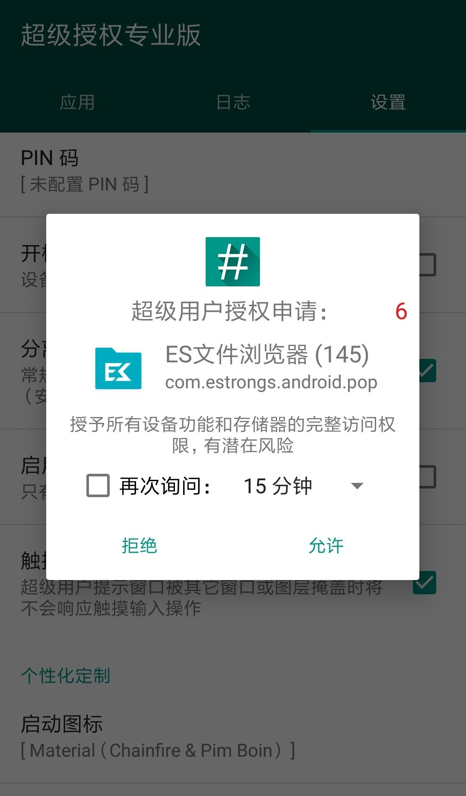
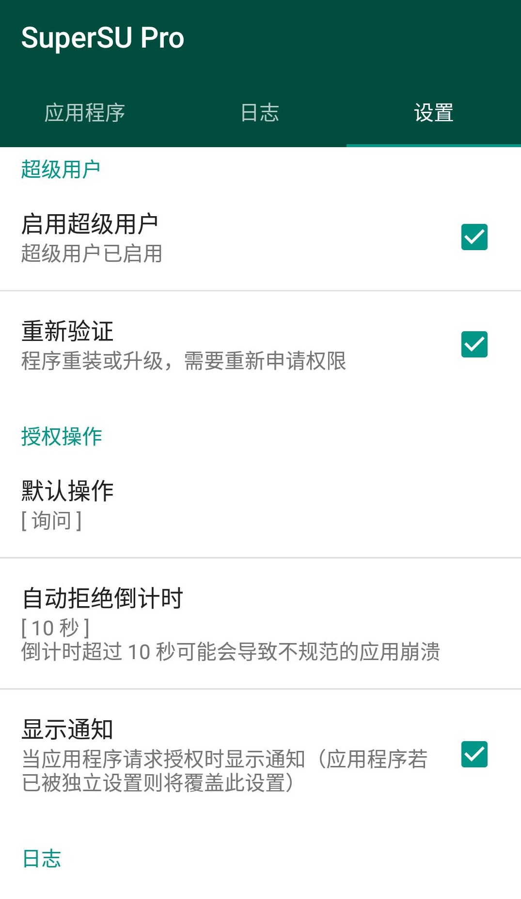

# SuperSU

&emsp;&emsp;安卓 8.0 之前，没有比 SuperSU 声誉更好、认可度最高的软件，只要是基于 Android 的设备，大家都会想到使用 Chainfire 的 SuperSU 来接管 Android 系统的 Root 权限。

    

&emsp;&emsp;在 2015 年 09 月 29 日，SuperSU 的作者 Chainfire 将 SuperSU 项目移交给了一家叫 Coding Code Mobile Technology LLC 的公司（简称 CCMT）。包括 SuperSU 源码、签名以及 Chainfire 自己的开发者账号。[XDA 相关说明](https://www.xda-developers.com/chainfire-makes-important-announcement-about-supersus-future/)

&emsp;&emsp;之后一段时间，chainfire 通过个人网站 [https://download.chainfire.eu/1220/SuperSU/](https://download.chainfire.eu/1220/SuperSU/) 继续维护 SuperSU。

&emsp;&emsp;2016 年 09 月 02 日，CCMT 通过 Google Play 商店发布了第一个由 CCMT 基于原 SuperSU 源码进行开发的第一个版本 v2.78，网友们仍使用的是 chainfire 个人网站的版本，CCMT 发布的版本不太受欢迎，CCMT 对 SuperSU 的开发也一直处于停滞状态。

&emsp;&emsp;2017 年 10 月 1 日，chainfire 发布了 SuperSU 的最后一个版本 `SR5-SuperSU-v2.82-SR5-20171001224502.zip`，此版本可获取部分安卓 8.0 Rom 的 Root 权限，之后开发者不再提供更新。

&emsp;&emsp;2018 年 10 月 2 日，SuperSU 从 Google Play 下架，这意味着 SuperSU 的时代的终结。

&emsp;&emsp;安卓 8.0 之后 MagiskSU 渐渐取代了 SuperSU，SuperSU 推出了历史的舞台。