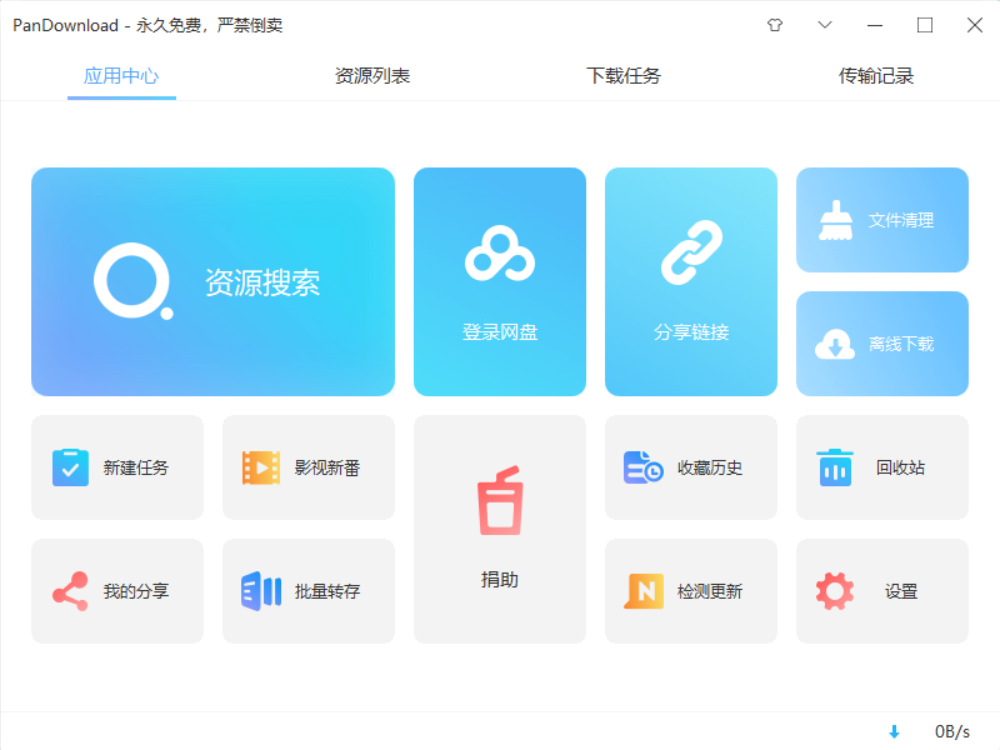
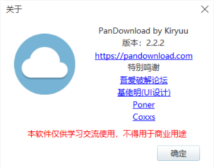
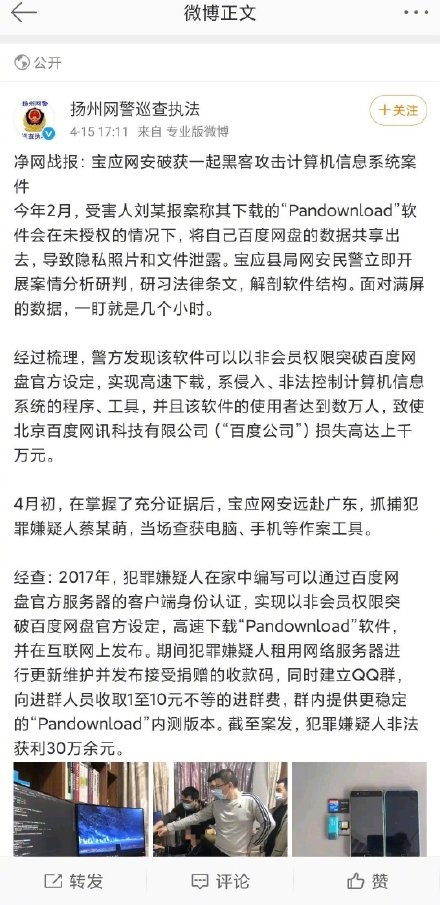
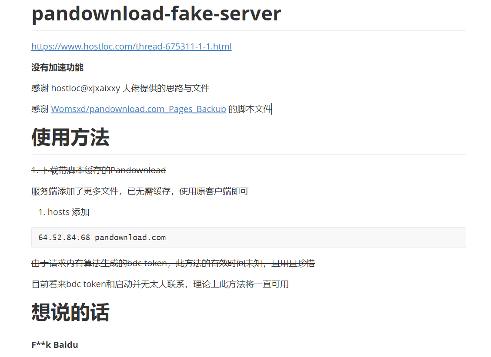
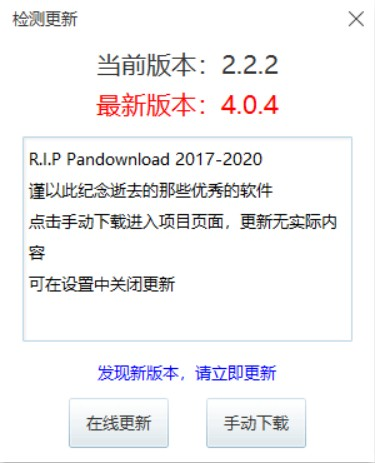
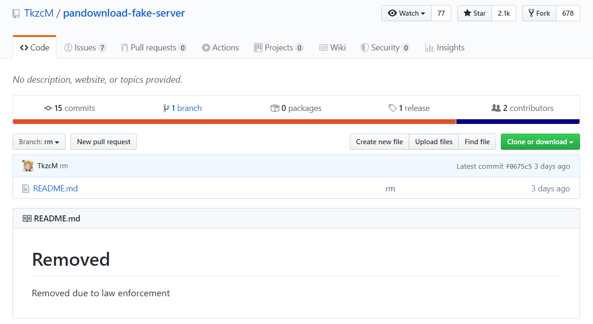

# Say Goodbye To PanDownload

&emsp;&emsp;从 2013 年开始，各大网络服务商相继提供超大空间免费网盘，从数百 GB 空间（金山快盘）开始，到数 TB 空间（百度，360，微云，115等），再到无限空间的出现（乐视云盘）。然而好景不长，2016 年各大网盘相继关停，360 推出付费网盘，当时有勇气购买 115 永久VIP 的用户成为了目前的真香用户， 115 几乎很少和谐用户资源，而且离线下载可以完爆迅雷和百度，微云空间缩水限速，金山，乐视等直接取消了网盘服务，百度网盘虽然空间没有缩水，但限速有多严重应该都深有体会了，而且开了会员还是限速。

&emsp;&emsp;因为限速严重，所以渐渐出现了第三方百度网盘的高速下载工具（PanDownload，油猴脚本，速盘，ENFI，亿寻）的出现，还有一些比较靠谱的加速下载工具（夸克，爱奇艺万能播放器）。在这些工具中，PanDownload 应该是功能和 UI 做的比较完善的三方客户端了，有不少用户反馈 PanDownload 甚至比官方的客户端更好用，而且可以免费使用，作者只接受赞助支持。

&emsp;&emsp;2019 年 4 月 15 日，微博上出现了 PanDownload 作者被抓的消息，随后各大媒体相继报道，至于作者怎样了，目前还没有消息，希望作者能有好的将来。

&emsp;&emsp;2019 年 4 月 16 日，Github 上出现名为 pandownload-fake-server 的项目，参考该项目，PanDownload 回光返照，更新 404 版本，暂时恢复了使用。

&emsp;&emsp;2019 年 4 月 21 日，pandownload-fake-server 项目清空，PanDownload 已无回天之力 ... ...

&emsp;&emsp;在我看来，PanDownload 在吾爱破解首发，并且更新三年左右，至少可以证名软件本身并没有太大安全隐患，个人认为隐私暴露应该是举报者使用不当造成的。不管怎么说已经发生的事，谁也无法挽回，PanDownload 作者的遭遇让我联想到了逗比根据地的站长，有时候，连一句谢谢都来不及说 ... ...

&emsp;&emsp;感谢 PanDownload 陪伴的这段时光，你的存在我会永远铭记 ... ...